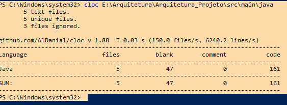

# Primeira parte
## Contagem das linhas antes da melhoria do código

### Usando a ferramenta cloc, que está no link abaixo: 
   [CLOC](https://github.com/AlDanial/cloc)

## Contagem das estruturas condicionais:
### Atualmente o código contpém 9 estruturas condicionais. 

## Quantidade de pontos para realizar as alterações:
###  - buscar melhorias para diminuir a quantidade de estruturas condicionais;
###  - buscar melhorias para tirar a planilha 'colocada' no código, e deixar mais claro para manutenibilidade.

# Segunda parte
